# 💼 Loan Service Project

A full-stack loan processing system built with **Spring Boot** and **Angular**, showcasing a modular microservices architecture.  
This project simulates real-world loan workflows — from counseling and application to judgment, approval, repayment, and dashboard tracking — with dedicated roles for both customers and managers.

---

## 🧰 Tech Stack

### 🔧 Backend
- **Spring Boot 3.4.1**
- **Spring Cloud** – Service discovery & config
- **Resilience4j** – Circuit breaking and fault tolerance
- **Keycloak** – Authentication & authorization
- **RabbitMQ** / **Kafka** – Messaging
- **H2** – In-memory database (for local/testing)
- **Docker** – Containerization
- **Observability Stack**:
    - **Grafana**, **Loki**, **Alloy**, **Prometheus**, **Tempo**
    - **OpenTelemetry** – Distributed tracing & metrics

### 🎨 Frontend
- **Angular 19.1.4**
- **Keycloak-js** – Client-side auth
- **Angular Material** / **Bootstrap** – UI frameworks
- **ApexCharts.js** – Data visualization & charts

---

## 🎯 Project Highlights

- Modular microservice architecture for each domain (counsel, application, judgment, etc.)
- Real-time async communication using Kafka/RabbitMQ
- Role-based access control using Keycloak (Customer / Manager)
- Real-time monitoring and distributed tracing via OpenTelemetry stack
- Interactive dashboards and flow-based UI for both customers and managers

---

## ✅ Prerequisites

To run this project locally, you'll need:

- **Java 21**
- **Maven**
- **Node.js + npm**
- **Docker** (for supporting services like Keycloak, RabbitMQ, etc.)

---

## 📐 Architecture

### 🗂️ System Architecture
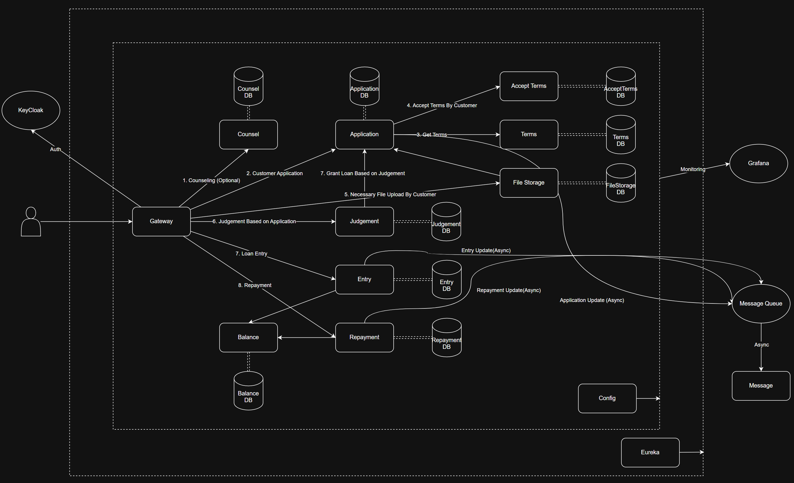

### 🔁 Application Flow
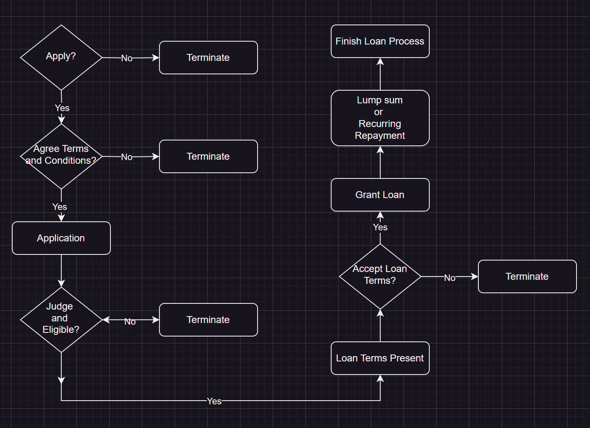

---

## 👤 Customer Workflow

### ✅ Input Validation
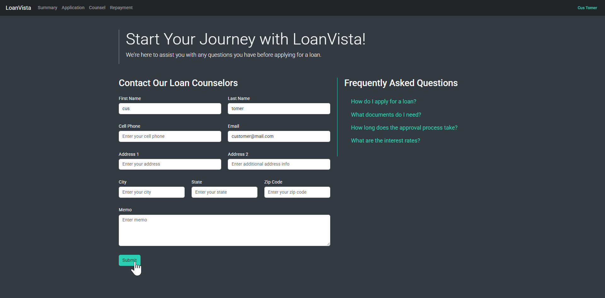

### 💬 Counseling
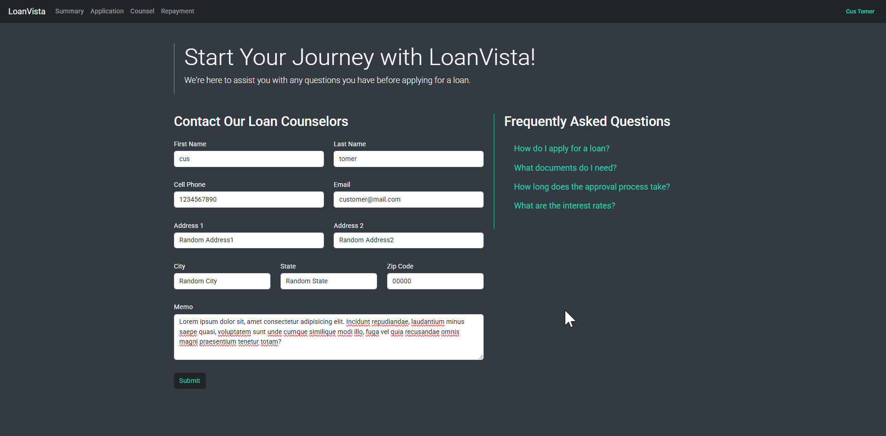

### 📝 Application Submission

### 📄 Contract Generation
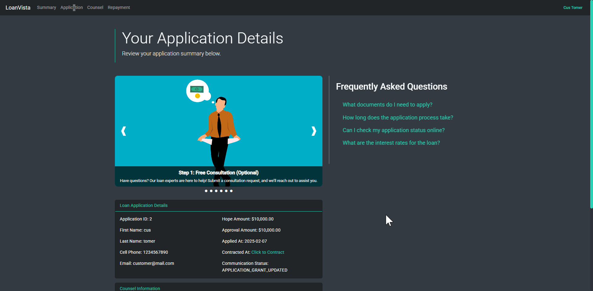

### 💸 Repayment Process
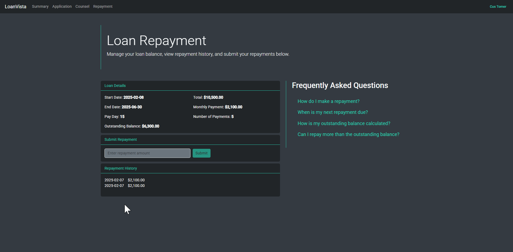

### 📘 Final Repayment Summary
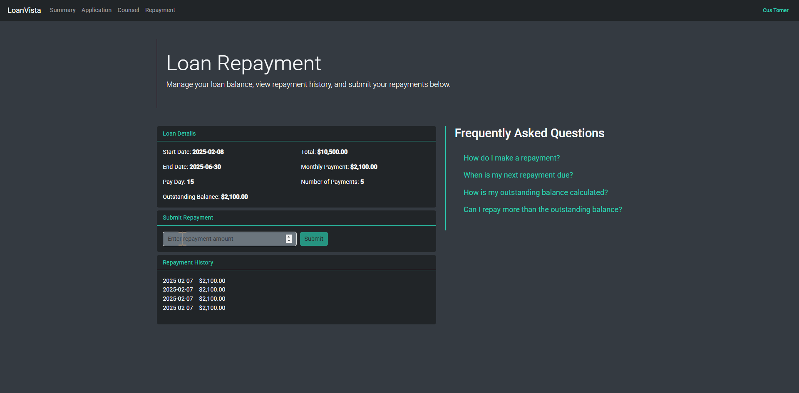

### 📊 Dashboard Overview
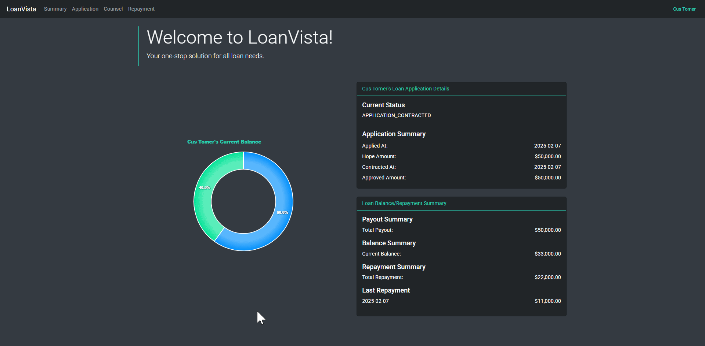

---

## 🧑‍💼 Manager Workflow

### 🗣️ Reviewing Counseling Sessions
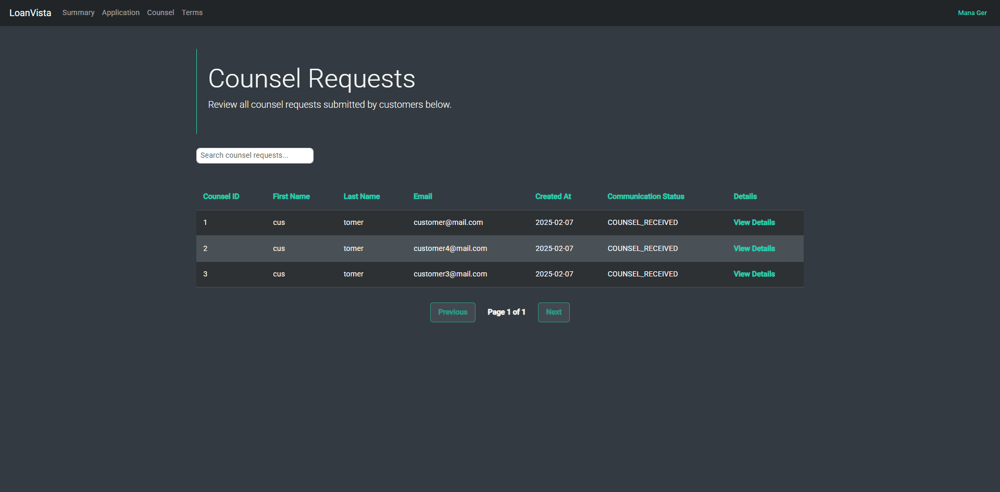

### 🧐 Application Judgment

### ✅ Approving Loan Decisions
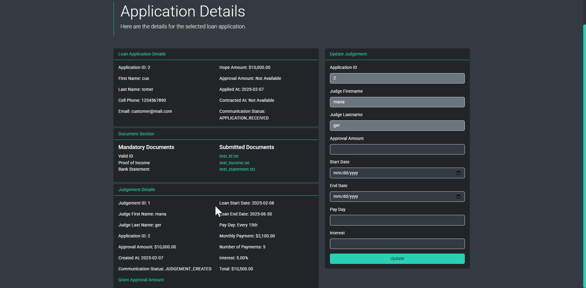

### 💵 Final Payout
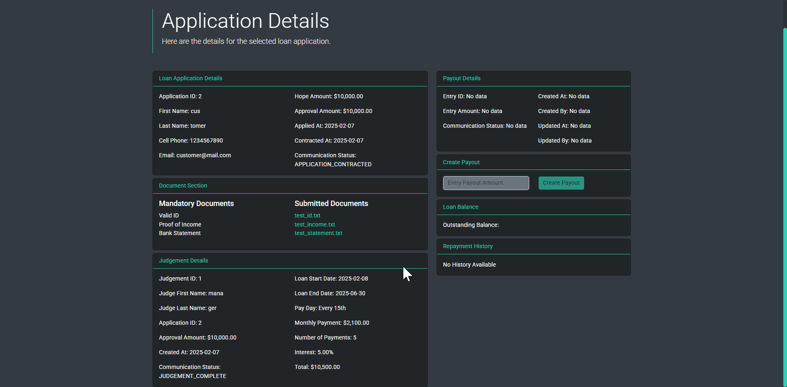

### 🧾 Final Application Review
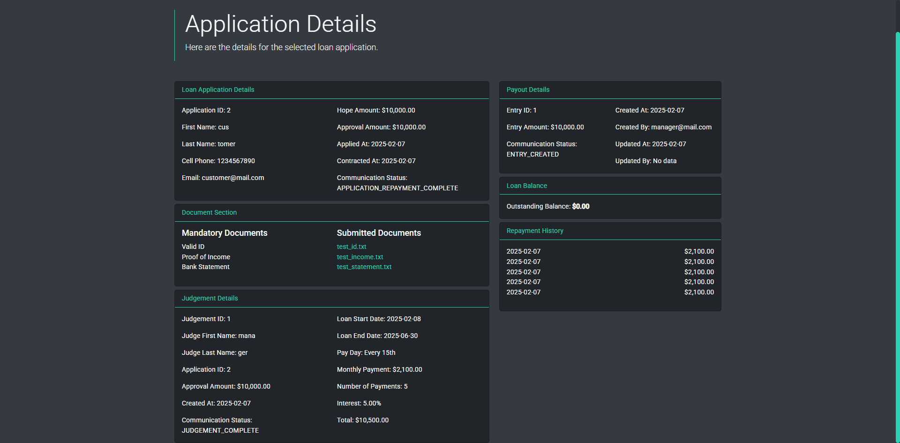

### 📈 Manager Dashboard
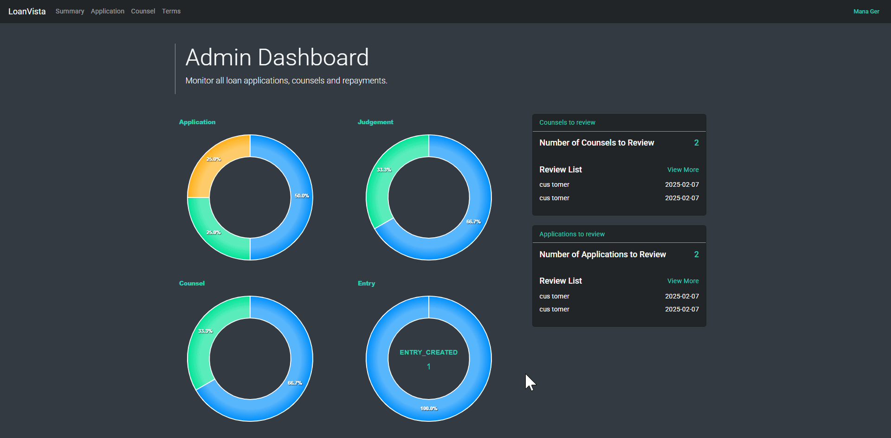
