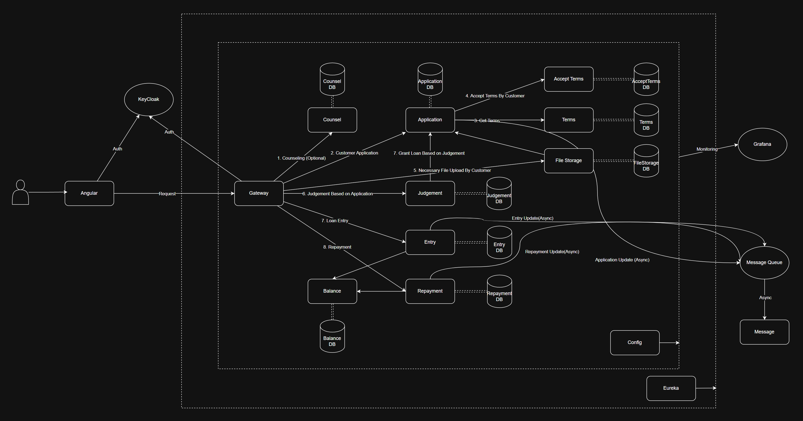

# Loan Service Project

## Description
This project is built using Spring Boot & Angular with microservices structure in the backend. It demonstrates how to create modular services that can be independently developed, deployed, monitored.
The project is to simulate loan processes that includes counsel, application, judgement, entry and repayment.

### Prerequisites
- Java 21
- Maven
- Spring Boot 3.4.1
- Angular 19.1.4

### Tech Stack

#### Backend
- **Spring Boot**
- **Spring Cloud**
- **Resilience4j**
- **Keycloak**
- **Grafana**
- **Loki**
- **Alloy**
- **Prometheus**
- **OpenTelemetry**
- **Tempo**
- **Docker**
- **RabbitMQ**
- **Kafka**
- **H2**

#### Frontend
- **Angular**
- **Keycloak-js**
- **Bootstrap**
- **ApexCharts.js**
- **Angular Material**

### Architecture Diagram

### Application Flow

### Customer Input Validation

### Customer Counsel

### Customer Application

### Customer Loan Contract

### Customer Repayment

### Customer Repayment Final

### Customer Dashboard

### Manager Counsel

### Manager Judgement

### Manager Grant Judgement

### Manager Payout

### Manager Application Final

### Manager Dashboard

